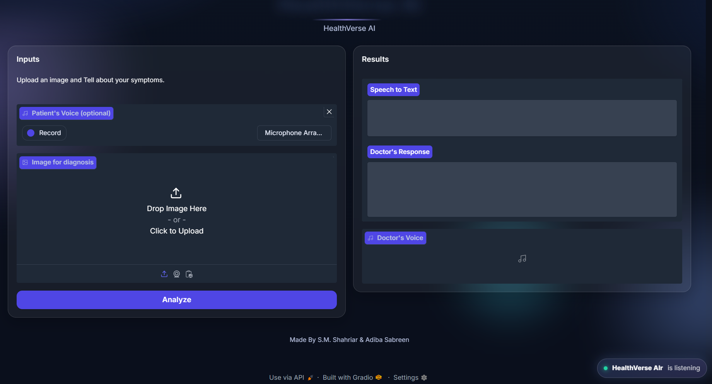
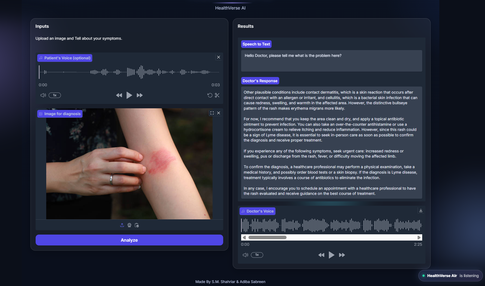

# Multimodal AI Doctor - HealthVerse AI

A multimodal AI-powered medical assistant that combines voice recognition, computer vision, and natural language processing to provide medical image analysis and diagnostic guidance. Built with Gradio, Groq APIs, and ElevenLabs text-to-speech.

---

## Demo Video

<video src="https://github.com/Sayeem-Velocity/Multimodal-AI-Doctor/raw/main/AI%20Doctor.mp4" autoplay loop muted playsinline width="100%"></video>

---

## Overview

HealthVerse AI is an agentic multimodal assistant that simulates how a real doctor listens, observes, and responds. The system integrates voice input, image analysis, clinical reasoning, and voice output into a single cohesive pipeline. Users can upload medical images (such as X-rays, skin conditions, or other diagnostic images) and optionally describe their symptoms using voice input. The AI analyzes both inputs and provides a comprehensive, empathetic medical assessment delivered through natural-sounding speech.

---

## User Interface





---

## Key Features

### Voice Input (Speech-to-Text)
The application uses Groq's Whisper Large v3 model to transcribe patient voice recordings. Users can describe their symptoms, medical history, or concerns using their microphone. The transcription is then combined with visual analysis for a more comprehensive assessment.

### Medical Image Analysis (Vision-Language Model)
Powered by Meta's Llama 4 Scout 17B model through Groq's API, the system analyzes uploaded medical images. The vision-language model examines visible symptoms, abnormalities, and clinical indicators in the image to form a diagnostic impression.

### Clinical Reasoning and Response Generation
The AI acts as a compassionate virtual doctor, providing:
- A clear initial assessment of the most likely condition
- Explanation of visible findings and their significance
- Differential diagnosis with alternative possibilities
- Practical care recommendations for home management
- Guidance on when to seek in-person medical attention
- Suggestions for confirmatory tests and treatment directions

### Voice Output (Text-to-Speech)
The doctor's response is converted to natural speech using ElevenLabs API with the Aria voice model. The system uses WAV format for maximum compatibility. If ElevenLabs is unavailable, the application falls back to Google Text-to-Speech (gTTS) as a backup.

### Modern User Interface
The application features a sleek, modern Gradio interface with:
- Dark theme with gradient backgrounds and floating orb animations
- Glass-morphism card design with hover effects
- Responsive grid layout for different screen sizes
- Custom CSS styling with smooth animations and transitions

---

## Project Architecture

```
multimodal-ai-doctor/
    app.py                 # Main Gradio application with UI and workflow
    doctor_brain.py        # Image encoding and Groq multimodal analysis
    doctor_voice.py        # ElevenLabs and gTTS text-to-speech functions
    patient_voice.py       # Audio recording and Groq Whisper transcription
    requirements.txt       # Python package dependencies
    .env                   # Environment variables for API keys
    .gitignore             # Git ignore patterns
    images/                # Sample images and UI screenshots
    README.md              # Project documentation
```

---

## Agentic AI Pipeline

The system operates as an agentic AI pipeline where multiple specialized models cooperate to process multimodal input:

### Stage 1: Voice Processing
The patient's spoken symptoms are captured through the microphone and transcribed using Whisper Large v3. This creates a text representation of the patient's verbal description of their condition.

### Stage 2: Image Encoding
The uploaded medical image is converted to base64 format for transmission to the multimodal language model. This encoding ensures the image data can be included in the API request.

### Stage 3: Multimodal Analysis
The Llama 4 Scout model receives both the transcribed text and the encoded image. It analyzes the visual content while considering the patient's described symptoms to form a comprehensive understanding.

### Stage 4: Clinical Response Generation
A carefully crafted system prompt guides the model to respond as a compassionate doctor. The response includes assessment, explanation, differential diagnosis, care recommendations, and next steps.

### Stage 5: Speech Synthesis
The generated text response is converted to natural speech using ElevenLabs' Turbo v2 model with the Aria voice, creating an audio file that plays in the interface.

---

## Technical Requirements

### System Requirements
- Python 3.10 or higher
- FFmpeg installed and available in system PATH (required for audio processing)
- Microphone access for voice input functionality
- Internet connection for API access

### API Keys Required
- Groq API Key: Required for Whisper transcription and Llama 4 Scout vision model
- ElevenLabs API Key: Required for high-quality text-to-speech (optional, falls back to gTTS)

---

## Installation Guide

### Step 1: Clone the Repository

```bash
git clone https://github.com/Sayeem-Velocity/Multimodal-AI-Doctor.git
cd Multimodal-AI-Doctor
```

### Step 2: Create Virtual Environment

```bash
python -m venv venv
```

Activate the virtual environment:

On Windows:
```bash
venv\Scripts\activate
```

On Linux or macOS:
```bash
source venv/bin/activate
```

### Step 3: Install Dependencies

```bash
pip install -r requirements.txt
```

### Step 4: Install FFmpeg

FFmpeg is required for audio processing with pydub.

On Windows:
Download from https://www.gyan.dev/ffmpeg/builds/ and add the bin folder to your system PATH.

On Linux (Debian/Ubuntu):
```bash
sudo apt update
sudo apt install ffmpeg
```

On macOS (using Homebrew):
```bash
brew install ffmpeg
```

### Step 5: Configure Environment Variables

Create a `.env` file in the project root directory:

```
GROQ_API_KEY=your_groq_api_key_here
ELEVEN_API_KEY=your_elevenlabs_api_key_here
```

To obtain API keys:
- Groq: Visit https://console.groq.com and create an account
- ElevenLabs: Visit https://elevenlabs.io and sign up for an account

---

## Running the Application

Start the Gradio application:

```bash
python app.py
```

The application will launch and display a local URL:

```
Running on local URL: http://127.0.0.1:7860
```

Open this URL in your web browser to access the HealthVerse AI interface.

---

## Usage Instructions

### Step 1: Record Your Symptoms (Optional)
Click the microphone button to record your voice describing your symptoms, medical history, or concerns. The recording will be transcribed automatically.

### Step 2: Upload a Medical Image
Upload a clear image of the medical condition you want analyzed. This could be:
- Skin conditions (rashes, lesions, wounds)
- X-ray images
- MRI or CT scan images
- Photographs of physical symptoms

### Step 3: Analyze
Click the "Analyze" button to process your inputs. The system will:
- Transcribe your voice recording (if provided)
- Analyze the uploaded image using the vision model
- Generate a comprehensive medical assessment
- Convert the response to speech

### Step 4: Review Results
The interface will display:
- Speech to Text: The transcription of your voice recording
- Doctor's Response: The written medical assessment
- Doctor's Voice: An audio playback of the response

---

## Models and Technologies Used

### Speech-to-Text
Whisper Large v3 running on Groq infrastructure provides fast and accurate transcription of patient voice recordings. Documentation available at https://console.groq.com/docs

### Vision-Language Model
Llama 4 Scout 17B is a mixture-of-experts model capable of understanding both text and images. It analyzes medical images and generates clinically-informed responses. Documentation available at https://console.groq.com/docs

### Text-to-Speech (Primary)
ElevenLabs eleven_turbo_v2 model with the Aria voice provides natural, human-like speech synthesis. The output is saved in WAV format for maximum compatibility. Documentation available at https://elevenlabs.io/docs

### Text-to-Speech (Fallback)
Google Text-to-Speech (gTTS) serves as a backup when ElevenLabs is unavailable. It produces MP3 output that plays seamlessly in the Gradio interface.

---

## Code Structure Details

### app.py
The main application file contains:
- Custom CSS styling for the modern dark theme interface
- The system prompt that guides the AI to respond as a doctor
- The process_inputs function that orchestrates the entire pipeline
- Gradio Blocks layout with input and output components

### doctor_brain.py
Handles image processing and multimodal analysis:
- encode_image: Converts image files to base64 format
- analyze_image_with_query: Sends text and image to Groq's Llama 4 Scout model

### doctor_voice.py
Manages text-to-speech conversion:
- text_to_speech_with_gtts: Google TTS implementation (MP3 output)
- text_to_speech_with_elevenlabs: ElevenLabs implementation (WAV output)

### patient_voice.py
Handles audio recording and transcription:
- record_audio: Captures microphone input and saves as MP3
- transcribe_with_groq: Sends audio to Whisper model for transcription

---

## Configuration Options

### ElevenLabs Voice Selection
The default voice is "Aria" but can be changed in doctor_voice.py. Available voices depend on your ElevenLabs account tier.

### Model Selection
The vision model can be changed in the process_inputs function. Currently uses "meta-llama/llama-4-scout-17b-16e-instruct".

### System Prompt Customization
The system_prompt variable in app.py can be modified to change the AI's response style, focus areas, or tone.

---

## Troubleshooting

### FFmpeg Not Found
If you receive errors about FFmpeg not being found:
- Verify FFmpeg is installed by running `ffmpeg -version` in your terminal
- Ensure the FFmpeg bin directory is added to your system PATH
- Restart your terminal after adding to PATH

### API Key Errors
If you receive authentication errors:
- Verify your .env file exists in the project root
- Check that API keys are correctly formatted without extra spaces
- Ensure your Groq and ElevenLabs accounts are active

### Audio Playback Issues
If audio does not play:
- Check your browser's audio permissions
- Verify your speakers or headphones are working
- Try a different browser if issues persist

### ElevenLabs Free Tier Limitations
Free tier accounts may have restrictions on:
- Number of characters per month
- Available voice options
- Output format options

The application will automatically fall back to gTTS if ElevenLabs fails.

---

## Disclaimer

This application is intended for educational and demonstration purposes only. It is not a substitute for professional medical advice, diagnosis, or treatment. Always seek the advice of a qualified healthcare provider with any questions you may have regarding a medical condition. Never disregard professional medical advice or delay in seeking it because of information provided by this AI system.

---

## Authors

Developed by S.M. Shahriar and Adiba Sabreen

---

## Contact and Support

For questions, issues, or collaboration opportunities:

Email: sayeem26s@gmail.com

LinkedIn: https://www.linkedin.com/in/s-m-shahriar-26s/

---

## License

This project is open source and available for educational and non-commercial use.
